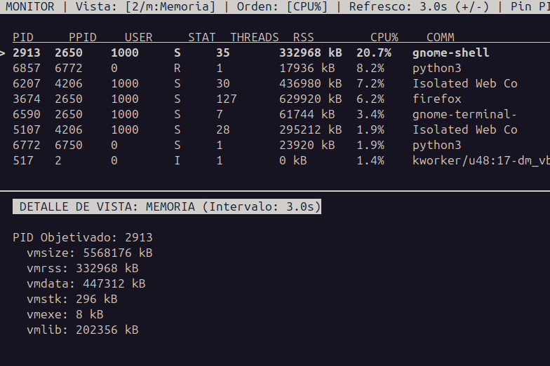

#  Monitor de Procesos y Threads
### TP1 - Computación II

##  Descripción General

Este proyecto es un monitor interactivo de procesos y métricas del sistema operativo Linux que funciona directamente desde la terminal (TUI).

Su objetivo principal es ofrecer una visión clara, estructurada y en tiempo real del estado de la máquina y de cada uno de sus procesos en ejecución, permitiendo analizar aspectos clave como el consumo de memoria, hilos, descriptores de archivos, señales y prioridades del planificador.

Para utilizarlo, basta con ejecutar el contenedor Docker e interactuar con el teclado dentro de la terminal.

El usuario puede:

- Alternar entre **7 vistas especializadas** mediante las teclas **1 a 7** (o sus letras correspondientes).
- Navegar por la lista de procesos con las flechas del teclado.
- Fijar un proceso específico con **Enter** para profundizar en sus métricas.
- Aplicar filtros en tiempo real por comando (`/`) o usuario (`u`).
- Cambiar el criterio de ordenamiento presionando **c** (CPU% → RSS → PID).
- Ajustar la frecuencia de refresco mediante las teclas **+** y **-**.

---
## Captura de pantalla



#  Arquitectura

El sistema está compuesto por tres procesos principales que comparten información mediante memoria compartida.

| Componente | Función |
|------------|---------|
| **Proceso Principal (`main`)** | Inicializa la memoria compartida, crea los subprocesos y captura señales del sistema (SIGINT, SIGHUP, SIGUSR1, SIGUSR2). |
| **Worker (Recolector)** | Lee la información de `/proc`, calcula las métricas (CPU, memoria, hilos, etc.) y actualiza el estado compartido. |
| **UI (TUI)** | Muestra la información en pantalla utilizando `curses`, recibe la entrada del usuario y permite cambiar vistas, filtros y ordenamientos. |
| **Memoria Compartida** | Almacena las métricas (`snapshot_dict`), los intervalos de actualización y el estado de ejecución para que ambos procesos puedan comunicarse. |

### Flujo de funcionamiento

```text
                +-----------------------+
                |   Proceso Principal   |
                |        (main)         |
                +-----------+-----------+
                            |
               crea los subprocesos
                            |
            +---------------+---------------+
            |                               |
            v                               v
+-------------------------+      +-------------------------+
|   Worker (Recolector)   |      |        UI (TUI)         |
|-------------------------|      |-------------------------|
| • Lee /proc             |      | • Muestra las vistas    |
| • Calcula métricas      |      | • Lee el teclado        |
| • Actualiza datos       |      | • Cambia filtros        |
+-----------+-------------+      +-------------+-----------+
            \                           /
             \                         /
              \                       /
               +---------------------+
               |  Memoria Compartida |
               |---------------------|
               | snapshot_dict       |
               | intervals_dict      |
               | running_flag        |
               +---------------------+

```

---

#  Decisiones de Diseño

##  Selección de Mecanismos de IPC

Para la transferencia de métricas entre el proceso recolector y la interfaz utilicé un diccionario compartido gestionado por `multiprocessing.Manager`.

Elegí este mecanismo porque la estructura de datos que viaja desde `/proc` hacia la TUI es compleja (diccionarios anidados con listas de procesos, métricas de memoria y textos de estado) y cambia dinámicamente según la cantidad de procesos activos. Intentar empaquetar esta estructura en memoria compartida tradicional hubiera requerido una serialización innecesaria.

Para los intervalos de refresco y el estado de ejecución utilicé `multiprocessing.Value`, ya que almacena valores atómicos simples con menor sobrecarga y acceso directo a memoria.

---

##  Manejo de Race Conditions

Las condiciones de carrera se evitaron definiendo claramente los roles de lectura y escritura.

- El **worker** es el único productor que escribe en `snapshot_dict`.
- La **TUI** únicamente consume dicha información.

Para evitar inconsistencias durante el renderizado, el worker reemplaza la estructura completa de una vista mediante una única asignación atómica, en lugar de modificar elemento por elemento.

Para el manejo de señales externas se implementó el patrón **Self-Pipe Trick**.

El handler únicamente escribe un byte dentro de un pipe (operación async-signal-safe), mientras que el bucle principal de la TUI lee ese byte y ejecuta la acción correspondiente (cerrar, recargar configuración o generar un snapshot).

---

##  Justificación de los Intervalos por Defecto

| Vista | Intervalo |
|--------|----------:|
| Resumen | 0.5 s |
| Threads | 0.5 s |
| Memoria | 1.0 s |
| Sistema Global | 1.0 s |
| File Descriptors | 2.0 s |
| Señales | 5.0 s |
| Scheduling | 5.0 s |

### Motivos

- **Resumen** y **Threads** cambian constantemente, por lo que requieren mayor frecuencia.
- **Memoria** y **Sistema Global** presentan cambios moderados.
- **File Descriptors** consulta `/proc/[pid]/fd`, operación relativamente costosa.
- **Señales** y **Scheduling** rara vez cambian durante la vida normal de un proceso.

---

#  Conceptos del Curso Aplicados

##  Sistema de archivos virtual `/proc`

Se accede directamente a los archivos del kernel sin utilizar bibliotecas como `psutil`.

En las vistas **Resumen** y **Scheduling** se interpreta `/proc/[pid]/stat` omitiendo correctamente el nombre del ejecutable cuando contiene espacios.

---

##  Procesos Zombie

En la vista **Sistema Global** se contabilizan los procesos según su estado:

- R
- S
- D
- T
- Z

Los procesos en estado **Zombie (Z)** representan procesos finalizados cuyo padre todavía no ejecutó `wait()`.

---

##  Handlers Async-Signal-Safe

Se implementó el manejo seguro de:

- SIGINT
- SIGHUP
- SIGUSR1
- SIGUSR2

mediante el patrón **Self-Pipe Trick**, evitando corrupción del estado interno de `curses`.

---

##  Cálculo del CPU%

El porcentaje de CPU se calcula mediante diferencias entre dos muestras consecutivas de:

```
utime + stime
```

utilizando la frecuencia del reloj del kernel (`SC_CLK_TCK`).

---

#  Limitaciones Conocidas

## Permisos sobre File Descriptors

Cuando el programa se ejecuta sin privilegios suficientes, `/proc/[pid]/fd` de procesos pertenecientes a otros usuarios puede devolver listas vacías.

---

## Muestreo inicial del CPU%

Durante los primeros segundos todos los procesos muestran **0.0%**, ya que aún no existe una muestra previa para calcular diferencias.

---

## Comandos truncados

El kernel limita el nombre almacenado en `/proc/[pid]/stat` a **16 caracteres**, por lo que la columna **COMM** puede aparecer truncada.

---

#  Cómo Ejecutar el Proyecto

## Método recomendado

Como la aplicación utiliza una interfaz interactiva basada en `curses`, se recomienda iniciarla directamente con:

```bash
docker compose run --rm monitor
```

Este comando conecta automáticamente la terminal al programa, permitiendo que la TUI funcione correctamente.

---

## Método alternativo

También es posible construir e iniciar el contenedor con:

```bash
docker compose up --build
```

y luego conectarse desde otra terminal mediante:

```bash
docker attach monitor_proc_tui
```

Sin embargo, **este método no se recomienda para la TUI**, ya que en algunos entornos la salida de `curses` no se renderiza correctamente y la pantalla puede actualizarse línea por línea, haciendo que el contenido del resumen se imprima indefinidamente en lugar de refrescarse.

---

#  Controles

| Tecla | Acción |
|--------|--------|
| 1–7 | Cambiar de vista |
| r m f t s p g | Cambiar de vista |
| ↑ ↓ | Navegar por procesos |
| Enter | Fijar PID |
| c | Cambiar criterio de ordenamiento |
| / | Filtrar por comando |
| u | Filtrar por usuario |
| + - | Cambiar frecuencia de refresco |
| q | Salir |

---

#  Pruebas de Señales

Desde otra terminal:

## Recargar configuración

```bash
docker kill --signal=SIGHUP monitor_proc_tui
```

## Generar Snapshot JSON

```bash
docker kill --signal=SIGUSR1 monitor_proc_tui
```

## Cierre seguro

```bash
docker kill --signal=SIGINT monitor_proc_tui
```

---

#  Decisiones sobre la TUI

Se eligió la biblioteca estándar **curses** porque:

- No requiere dependencias externas.
- Es completamente portable.
- Permite controlar cada celda de la terminal.

La interfaz utiliza un **Split Layout**:

- Parte superior: lista general de procesos.
- Parte inferior: panel de detalle de la vista activa o del proceso fijado.

Esto mantiene el contexto del sistema mientras se inspecciona información detallada.

---

# Lo que Aprendí

El desarrollo de este proyecto me permitió comprender mucho mejor cómo se aplican en la práctica los conceptos vistos durante la materia. Trabajar directamente con el sistema de archivos virtual `/proc` me ayudó a entender cómo obtener información sobre el estado de los procesos, el uso de memoria, los hilos, los descriptores de archivos, las señales y la planificación del CPU, sin depender de bibliotecas de alto nivel. También pude ver cómo herramientas como `top` o `htop` construyen la información que muestran a partir de los datos que expone el kernel y entender que muchas de las métricas no están disponibles de forma directa, sino que deben calcularse o interpretarse a partir de la información que proporciona el sistema.

Por otro lado, diseñar una aplicación formada por varios procesos me permitió aplicar conceptos de concurrencia, comunicación entre procesos (IPC) y sincronización para que todos los componentes trabajaran de forma coordinada. Durante el desarrollo aprendí la importancia de definir claramente qué proceso es responsable de leer o modificar cada dato compartido para evitar condiciones de carrera y comportamientos inconsistentes. Además, implementar el manejo de señales para realizar un cierre limpio, recargar la configuración y generar snapshots me permitió comprender mejor cómo responder a eventos del sistema sin afectar el funcionamiento de una aplicación interactiva.
